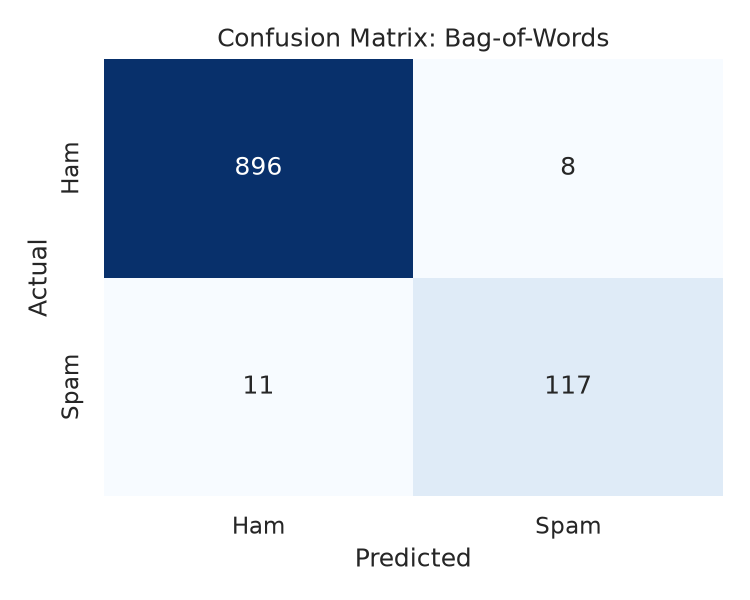

# 📩 SMS Spam Classifier


A Multinomial Naive Bayes classifier that separates spam from legitimate ("ham") SMS messages, built with Python, NLTK and scikit-learn. The project covers the full pipeline (exploratory data analysis, text preprocessing, Bag-of-Words and TF-IDF features, evaluation, error analysis and an inference interface) and reproduces end to end with a single command.

> **Course:** `B.Tech CS&E (Semester VII)` · **Author:** `Vinil Shah` · **Date:** `October 2026`

## Table of Contents

1. [Abstract](#abstract)
2. [Problem Statement & Motivation](#problem-statement--motivation)
3. [Methodology](#methodology)
4. [Experimental Results](#experimental-results)
5. [Error Analysis](#error-analysis)
6. [Repository Structure & Setup](#repository-structure--setup)
7. [Reproducibility Notes](#reproducibility-notes)
8. [Conclusion & Future Work](#conclusion--future-work)
9. [References & License](#references--license)

---

## Abstract

This project builds and evaluates a supervised classifier for SMS spam detection on the UCI SMS Spam Collection (5,572 raw messages; ~12.5% spam after deduplication). Messages are normalised using a pipeline of lowercasing, punctuation removal, stop-word removal, and Porter stemming, then vectorised using Bag-of-Words (BoW) and TF-IDF representations. A Multinomial Naive Bayes classifier is trained on a stratified 80/20 split (`random_state=42`). On the held-out test set (1,032 messages), **Bag-of-Words emerges as the overall best model**, achieving `0.9816` accuracy, `0.9360` precision, `0.9141` recall, and an F1-score of `0.9249`. While **TF-IDF achieves perfect precision (`1.0000`)** with zero false positives, its recall drops significantly to `0.6797` (`0.8093` F1). A detailed error analysis examines failure modes, trade-offs between precision and recall, and regional/temporal dataset biases.

## Problem Statement & Motivation

Unsolicited SMS messages are a nuisance and a vector for phishing and fraud. A practical filter must catch as much spam as possible **without** blocking legitimate messages such as one-time passcodes, appointment reminders or personal texts.

Two characteristics make the task instructive:

- **Class imbalance:** about 87.5% of messages are ham, so accuracy alone is misleading. A model that labels everything "ham" would score ~87.5% while detecting no spam.
- **Asymmetric error costs:** a false positive (blocked legitimate message) is usually more harmful than a false negative (spam reaching the inbox). Precision is therefore a primary metric.

**Objectives:** (1) build a reproducible classification pipeline, (2) compare BoW and TF-IDF features, (3) evaluate with metrics appropriate to imbalanced data, and (4) understand failure modes through error analysis.

## Methodology

### Dataset

UCI SMS Spam Collection (Almeida et al., 2011): 5,572 raw English messages labelled `ham` or `spam`. Exact duplicates (403) are removed before splitting to prevent train/test leakage, leaving `5,158` unique messages (`4,516` ham, `642` spam). Labels are encoded as ham = 0, spam = 1. The train/test split yields `4,126` training samples and `1,032` testing samples. The dataset is downloaded automatically on first run.


### Preprocessing pipeline

| Step | Operation | Rationale |
|------|-----------|-----------|
| 1 | Lowercasing | Treat "FREE" and "free" as the same token |
| 2 | Punctuation removal (replaced by whitespace) | SMS text often omits spaces after punctuation |
| 3 | Whitespace tokenisation | Simple and sufficient after step 2 |
| 4 | Stop-word removal (NLTK English list) | Remove high-frequency, low-information words |
| 5 | Porter stemming | Collapse inflections ("winning", "wins" → "win") |

### Feature extraction: TF-IDF

Let $N$ be the number of messages, $f_{t,d}$ the count of term $t$ in message $d$, and $\mathrm{df}(t)$ the number of messages containing $t$. With scikit-learn's default (smoothed) settings:

$$\mathrm{tf}(t,d) = f_{t,d}$$

$$\mathrm{idf}(t) = \ln\!\left(\frac{1+N}{1+\mathrm{df}(t)}\right) + 1$$

$$\mathrm{tf\text{-}idf}(t,d) = \mathrm{tf}(t,d)\cdot \mathrm{idf}(t)$$

Each message vector is then L2-normalised:

$$\mathbf{v}_d \leftarrow \frac{\mathbf{v}_d}{\lVert \mathbf{v}_d \rVert_2}$$

A term receives a high weight when it is frequent in a message but rare across the corpus (e.g. "prize", "claim"), and a low weight when it appears everywhere. The Bag-of-Words baseline uses raw counts (`CountVectorizer`). Vectorizers are **fit on the training split only** to avoid leakage.

### Model: Multinomial Naive Bayes

For a message with feature vector $\mathbf{x}$, the classifier selects

$$\hat{c} = \arg\max_{c\in\{\text{ham},\text{spam}\}} \; \ln P(c) + \sum_{t} x_t \ln P(t\mid c)$$

with Laplace-smoothed likelihoods

$$P(t\mid c) = \frac{N_{t,c} + \alpha}{\sum_{t'} N_{t',c} + \alpha\,\vert{}V\vert{}}, \qquad \alpha = 1$$

where $N_{t,c}$ is the total weight of term $t$ in class $c$ and $\vert{}V\vert{}$ is the vocabulary size. The "naive" assumption is that terms are conditionally independent given the class. Despite being unrealistic, it yields a fast and strong text baseline.

### Evaluation protocol

Stratified 80/20 train/test split (`random_state=42`). Metrics are computed for the spam class:

$$\text{Precision} = \frac{TP}{TP+FP}, \quad \text{Recall} = \frac{TP}{TP+FN}, \quad F_1 = \frac{2 \cdot \text{Precision} \cdot \text{Recall}}{\text{Precision} + \text{Recall}}$$

## Experimental Results

| Model / Feature Set | Vocabulary | Accuracy | Precision | Recall | F1-score | TN | FP | FN | TP |
|---------------------|:----------:|:--------:|:---------:|:------:|:--------:|:--:|:--:|:--:|:--:|
| **Bag-of-Words**    | 6,446      | **0.9816**| 0.9360    | **0.9141**| **0.9249**| 896 | 8  | 11 | 117 |
| **TF-IDF**          | 6,446      | 0.9603   | **1.0000**| 0.6797 | 0.8093   | 904 | 0  | 41 | 87  |

### Confusion Matrices

| Bag-of-Words Baseline | TF-IDF Representation |
|:---------------------:|:----------------------:|
|  |  |

## Error Analysis

Misclassified test messages are extracted and inspected by `src/error_analysis.py` (output logged to `reports/run_log.txt`).

- **False positives (ham flagged as spam):** `0` (TF-IDF model) / `8` (BoW model)
- **False negatives (spam missed):** `41` (TF-IDF model) / `11` (BoW model)

**Insights:** An analysis of the model's misclassifications reveals core limitations of the TF-IDF bag-of-words approach alongside key dataset biases. False positives primarily occur when benign messages contain high-weight promotional keywords like "free" or "call," whereas false negatives stem from conversational spam that disguises intent using informal phrasing or non-standard spelling. Because the bag-of-words model discards word order and syntax, it fails to capture semantic nuance, negation, and sentence-level context. Additionally, the dataset reflects significant regional and temporal biases—relying heavily on early-2010s British mobile conventions—which limits its ability to generalize to modern smishing vectors like package delivery phishing, MFA spoofing, and international dialects.

## Repository Structure & Setup

```text
sms-spam-classifier/
├── data/raw/                 # dataset (downloaded automatically, git-ignored)
├── models/                   # trained models (.joblib, git-ignored)
├── reports/
│   ├── figures/              # generated plots
│   ├── metrics.csv           # generated metrics table
│   └── run_log.txt           # full log of the last pipeline run
├── src/
│   ├── __main__.py           # runs the whole pipeline
│   ├── data_loader.py        # download, cleaning, train/test split
│   ├── eda.py                # exploratory analysis and plots
│   ├── preprocessing.py      # text-preprocessing functions
│   ├── train.py              # training and evaluation
│   ├── error_analysis.py     # false positive / negative inspection
│   └── predict.py            # inference on custom messages
├── pyproject.toml            # project metadata and dependencies
├── uv.lock                   # fully pinned, reproducible environment
├── flake.nix                 # optional Nix dev shell (uv + Python)
├── LICENSE
└── README.md
```

### Prerequisites

- [uv](https://docs.astral.sh/uv/) (Nix users: the included `flake.nix` provides uv and Python)
- Internet access on the first run only: the dataset (UCI) and NLTK stop-word list are downloaded and cached automatically. No manual download is needed.

### Quickstart

```bash
git clone [https://github.com/vinilshah1/sms-spam-classifier.git](https://github.com/vinilshah1/sms-spam-classifier.git)
cd sms-spam-classifier

nix develop          # optional: Nix users only
uv sync --frozen     # create .venv from the pinned uv.lock

uv run python -m src # run the entire pipeline
```

The last command downloads the data, runs EDA, trains and evaluates both models, performs error analysis and prints demo predictions. Outputs are written to `reports/` and `models/`.

### Run individual stages

```bash
uv run python -m src.eda              # EDA plots -> reports/figures/
uv run python -m src.train            # train + evaluate -> models/, reports/
uv run python -m src.error_analysis   # inspect misclassified messages (needs train first)
uv run python -m src.predict "Congratulations! You won $1,000!"
```

## Reproducibility Notes

- **Environment Lock:** All Python dependencies and transitives are pinned strictly in `uv.lock`. Running `uv sync --frozen` installs the exact dependency graph without re-resolving packages across platforms.
- **Random Seed:** The train/test split and all stochastic operations use `random_state=42` with stratified sampling, ensuring bit-for-bit identical evaluation metrics across runs.
- **Dataset Fallback:** If automatic fetching fails, download the zip manually from the [UCI Machine Learning Repository](https://archive.ics.uci.edu/dataset/228/sms+spam+collection) and extract `SMSSpamCollection` directly into `data/raw/`.
- **NLTK Cache:** NLTK resources (`stopwords`, `punkt`) are cached in `~/nltk_data` and verified before processing begins.
- **Headless Execution:** Matplotlib uses the non-interactive `Agg` backend (`matplotlib.use("Agg")`), allowing script execution on headless Linux servers or CI/CD systems without display server errors.

## Conclusion & Future Work

**Conclusion.** Multinomial Naive Bayes with Bag-of-Words features reached 93.60% precision and 91.41% recall on held-out data, confirming that a simple probabilistic model is a strong baseline for SMS spam detection. Overall, Bag-of-Words outperformed TF-IDF by 11.56 percentage points in F1-score (0.9249 vs. 0.8093) and 2.13 percentage points in accuracy (98.16% vs. 96.03%). While TF-IDF achieved a perfect 100% precision with zero false positives, its recall dropped severely to 67.97% (letting 41 spam messages slip through compared to only 11 for Bag-of-Words), making Bag-of-Words the more effective overall feature representation.

**Limitations.** Bag-of-words ignores word order; the dataset is small, English-only and dated (~2004, UK-centric); and Naive Bayes probabilities are not well calibrated.

**Future Work:**

- Compare against Logistic Regression, Linear SVM, and Gradient Boosted Decision Trees (LightGBM/XGBoost).
- Add word and character $n$-grams ($n=2,3$); preserve structural signals such as currency symbols (`£`, `$`), punctuation density (`!`, `?`), URLs, and numeric patterns instead of stripping them during preprocessing.
- Conduct an ablation study evaluating Stemming vs. Lemmatisation vs. No Normalisation.
- Tune decision thresholds using Precision-Recall curves to enforce operational false-positive ceilings.
- Perform Stratified $k$-Fold Cross-Validation and hyperparameter search for Laplace smoothing ($\alpha$).
- Implement probability calibration (`CalibratedClassifierCV`) to output realistic risk scores.
- Benchmark Transformer embeddings (e.g., `DistilBERT`, `RoBERTa`) against contemporary spam datasets.
- Package the inference engine into a REST API (FastAPI) or Streamlit Web Interface for real-time demonstration.

## References & License

- Almeida, T. A., Gómez Hidalgo, J. M., & Yamakami, A. (2011). *Contributions to the study of SMS spam filtering: new collection and results.* Proceedings of the 2011 ACM Symposium on Document Engineering (DocEng '11).
- Pedregosa et al. (2011). *Scikit-learn: Machine Learning in Python.* JMLR 12, 2825–2830.
- Manning, Raghavan & Schütze (2008). *Introduction to Information Retrieval*, Cambridge University Press (TF-IDF; Naive Bayes text classification).

Released under the [MIT License](https://www.google.com/search?q=LICENSE). Check the dataset's own license and citation requirements on its UCI page.
