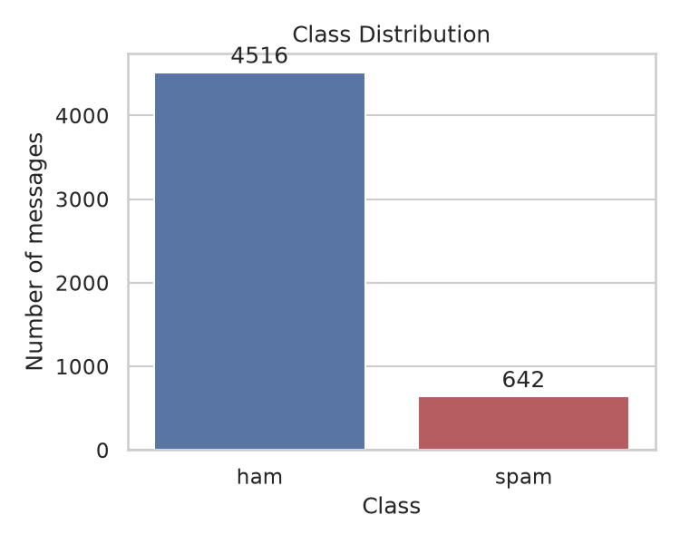
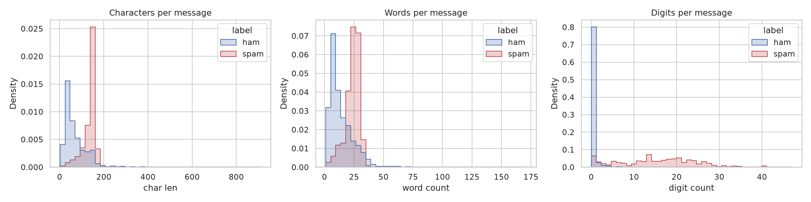
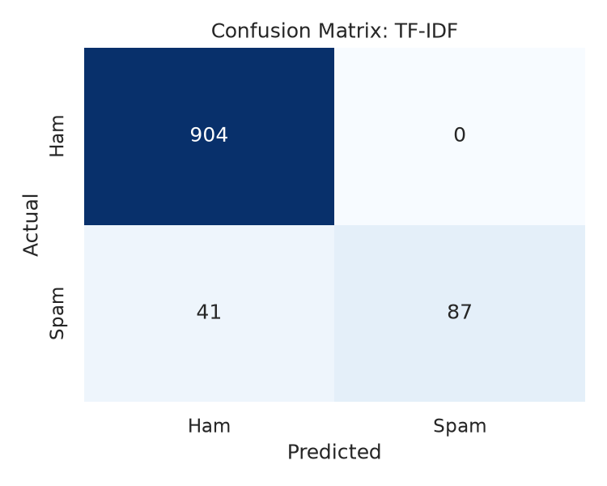

# 📩 SMS Spam Classifier


A Multinomial Naive Bayes classifier that separates spam from legitimate ("ham") SMS messages, built with Python, NLTK and scikit-learn. The project covers the full pipeline (exploratory data analysis, text preprocessing, Bag-of-Words and TF-IDF features, evaluation, error analysis and an inference interface) and reproduces end to end with a single command.

> **Course:** `<course name / code>` · **Author:** `<your name>` · **Date:** `<month year>`

## Table of Contents
1. [Abstract](#abstract)
2. [Problem Statement & Motivation](#problem-statement--motivation)
3. [Methodology](#methodology)
4. [Experimental Results](#experimental-results)
5. [Error Analysis](#error-analysis)
6. [Repository Structure & Setup](#repository-structure--setup)
7. [Conclusion & Future Work](#conclusion--future-work)
8. [References & License](#references--license)

---

## Abstract

This project builds and evaluates a supervised classifier for SMS spam detection on the UCI SMS Spam Collection (5,574 labelled messages; ~13% spam). Messages are normalised with a pipeline of lowercasing, punctuation removal, stop-word removal and Porter stemming, then vectorised using Bag-of-Words and TF-IDF representations. A Multinomial Naive Bayes classifier is trained on a stratified 80/20 split (`random_state=42`). The TF-IDF model achieves `__` accuracy, `__` precision, `__` recall and an F1-score of `__` on the held-out test set. Because misclassifying legitimate messages as spam is costly, the analysis emphasises precision alongside recall, and a manual error analysis examines the remaining false positives and false negatives.

## Problem Statement & Motivation

Unsolicited SMS messages are a nuisance and a vector for phishing and fraud. A practical filter must catch as much spam as possible **without** blocking legitimate messages such as one-time passcodes, appointment reminders or personal texts.

Two characteristics make the task instructive:

- **Class imbalance:** about 87% of messages are ham, so accuracy alone is misleading. A model that labels everything "ham" would score ~87% while detecting no spam.
- **Asymmetric error costs:** a false positive (blocked legitimate message) is usually more harmful than a false negative (spam reaching the inbox). Precision is therefore a primary metric.

**Objectives:** (1) build a reproducible classification pipeline, (2) compare BoW and TF-IDF features, (3) evaluate with metrics appropriate to imbalanced data, and (4) understand failure modes through error analysis.

## Methodology

### Dataset
UCI SMS Spam Collection (Almeida et al., 2011): 5,574 English messages labelled `ham` or `spam` (4,827 / 747). Exact duplicates are removed before splitting to prevent train/test leakage, leaving `__` unique messages (`__` ham, `__` spam). Labels are encoded as ham = 0, spam = 1. The dataset is downloaded automatically on first run.




`<!-- TODO: one or two sentences on what the plots show, e.g. how spam differs from ham in length and digit count -->`

### Preprocessing pipeline

| Step | Operation | Rationale |
|------|-----------|-----------|
| 1 | Lowercasing | Treat "FREE" and "free" as the same token |
| 2 | Punctuation removal (replaced by whitespace) | SMS text often omits spaces after punctuation |
| 3 | Whitespace tokenisation | Simple and sufficient after step 2 |
| 4 | Stop-word removal (NLTK English list) | Remove high-frequency, low-information words |
| 5 | Porter stemming | Collapse inflections ("winning", "wins" → "win") |

### Feature extraction: TF-IDF

Let $N$ be the number of messages, $f_{t,d}$ the count of term $t$ in message $d$, and $\mathrm{df}(t)$ the number of messages containing $t$. With scikit-learn's default (smoothed) settings:

$$\mathrm{tf}(t,d) = f_{t,d}$$

$$\mathrm{idf}(t) = \ln\!\left(\frac{1+N}{1+\mathrm{df}(t)}\right) + 1$$

$$\mathrm{tf\text{-}idf}(t,d) = \mathrm{tf}(t,d)\cdot \mathrm{idf}(t)$$

Each message vector is then L2-normalised:

$$\mathbf{v}_d \leftarrow \frac{\mathbf{v}_d}{\lVert \mathbf{v}_d \rVert_2}$$

A term receives a high weight when it is frequent in a message but rare across the corpus (e.g. "prize", "claim"), and a low weight when it appears everywhere. The Bag-of-Words baseline uses raw counts (`CountVectorizer`). Vectorizers are **fit on the training split only** to avoid leakage.

### Model: Multinomial Naive Bayes

For a message with feature vector $\mathbf{x}$, the classifier selects

$$\hat{c} = \arg\max_{c\in\{\text{ham},\text{spam}\}} \; \ln P(c) + \sum_{t} x_t \ln P(t\mid c)$$

with Laplace-smoothed likelihoods

$$P(t\mid c) = \frac{N_{t,c} + \alpha}{\sum_{t'} N_{t',c} + \alpha\,|V|}, \qquad \alpha = 1$$

where $N_{t,c}$ is the total weight of term $t$ in class $c$ and $|V|$ is the vocabulary size. The "naive" assumption is that terms are conditionally independent given the class. Despite being unrealistic, it yields a fast and strong text baseline.

### Evaluation protocol
Stratified 80/20 train/test split (`random_state=42`). Metrics are computed for the spam class:
$\text{Precision} = \frac{TP}{TP+FP}$, $\text{Recall} = \frac{TP}{TP+FN}$, $F_1 = \frac{2PR}{P+R}$.

## Experimental Results

| Features | Accuracy | Precision | Recall | F1-score |
|----------|:--------:|:---------:|:------:|:--------:|
| Bag-of-Words | __ | __ | __ | __ |
| TF-IDF | __ | __ | __ | __ |

*Test set: `__` messages (`__` spam). Positive class = spam. Raw numbers: `reports/metrics.csv`.*

### Confusion matrix (TF-IDF)



|  | Predicted ham | Predicted spam |
|---|:---:|:---:|
| **Actual ham** | TN = __ | FP = __ |
| **Actual spam** | FN = __ | TP = __ |

**Interpretation:** `<!-- TODO -->` Describe how many legitimate messages were wrongly blocked (FP), how much spam slipped through (FN), and how this maps to the precision and recall above. Note the precision/recall trade-off and which error type the model favours. Because the test set contains only ~`__` spam messages, each missed spam message moves recall noticeably, so read the results with that variance in mind.

## Error Analysis

Misclassified test messages are extracted and inspected by `src/error_analysis.py` (output in `reports/run_log.txt`).

**False positives (ham flagged as spam):** `<!-- TODO: paste 2-3 representative examples -->`

**False negatives (spam missed):** `<!-- TODO: paste 2-3 representative examples -->`

**Insights:** `<!-- TODO -->` Summarise the patterns you observed, for example shared vocabulary in the false positives, spam written in a conversational tone among the false negatives, the limits of a bag-of-words model (no word order or context), and the age and regional bias of the dataset.

## Repository Structure & Setup

```
sms-spam-classifier/
├── data/raw/                 # dataset (downloaded automatically, git-ignored)
├── models/                   # trained models (.joblib, git-ignored)
├── reports/
│   ├── figures/              # generated plots
│   ├── metrics.csv           # generated metrics table
│   └── run_log.txt           # full log of the last pipeline run
├── src/
│   ├── __main__.py           # runs the whole pipeline
│   ├── data_loader.py        # download, cleaning, train/test split
│   ├── eda.py                # exploratory analysis and plots
│   ├── preprocessing.py      # text-preprocessing functions
│   ├── train.py              # training and evaluation
│   ├── error_analysis.py     # false positive / negative inspection
│   └── predict.py            # inference on custom messages
├── pyproject.toml            # project metadata and dependencies
├── uv.lock                   # fully pinned, reproducible environment
├── flake.nix                 # optional Nix dev shell (uv + Python)
├── LICENSE
└── README.md
```

### Prerequisites
- [uv](https://docs.astral.sh/uv/) (Nix users: the included `flake.nix` provides uv and Python)
- Internet access on the first run only: the dataset (UCI) and NLTK stop-word list are downloaded and cached automatically. No manual download is needed.

### Quickstart

```bash
git clone https://github.com/<your-username>/sms-spam-classifier.git
cd sms-spam-classifier

nix develop          # optional: Nix users only
uv sync --frozen     # create .venv from the pinned uv.lock

uv run python -m src # run the entire pipeline
```

The last command downloads the data, runs EDA, trains and evaluates both models, performs error analysis and prints demo predictions. Outputs are written to `reports/` and `models/`.

### Run individual stages

```bash
uv run python -m src.eda              # EDA plots -> reports/figures/
uv run python -m src.train            # train + evaluate -> models/, reports/
uv run python -m src.error_analysis   # inspect misclassified messages (needs train first)
uv run python -m src.predict "Congratulations! You won $1,000!"
```

### Reproducibility notes
- Dependencies are pinned in `uv.lock`; `--frozen` installs them exactly without re-resolving.
- The train/test split is stratified with `random_state=42`.
- If the automatic download fails, get the data from the [UCI repository](https://archive.ics.uci.edu/dataset/228/sms+spam+collection) and place the `SMSSpamCollection` file in `data/raw/`.
- NLTK data is stored in `~/nltk_data` (outside the lockfile) and fetched on first use.

## Conclusion & Future Work

**Conclusion.** `<!-- TODO -->` Multinomial Naive Bayes with `<best feature set>` reached `__` precision and `__` recall on held-out data, confirming that a simple probabilistic model is a strong baseline for SMS spam detection. `<State whether BoW or TF-IDF won and by how much.>`

**Limitations.** Bag-of-words ignores word order; the dataset is small, English-only and dated (~2004, UK-centric); and Naive Bayes probabilities are not well calibrated.

**Future work**
- Compare against Logistic Regression, Linear SVM and ensemble models
- Add word and character n-grams; preserve signals such as `£`, `$`, `!`, URLs and digit patterns instead of discarding them
- Ablation: stemming vs. lemmatisation vs. no normalisation
- Tune the decision threshold with a precision-recall curve to target a chosen precision level
- Stratified k-fold cross-validation and hyperparameter search (e.g. `alpha`)
- Probability calibration (`CalibratedClassifierCV`)
- Transformer embeddings (e.g. DistilBERT) and evaluation on more recent spam data
- Deploy as a small web app (Streamlit or FastAPI)

## References & License

- Almeida, T. A., Gómez Hidalgo, J. M., & Yamakami, A. (2011). *Contributions to the study of SMS spam filtering: new collection and results.* Proceedings of the 2011 ACM Symposium on Document Engineering (DocEng '11).
- Pedregosa et al. (2011). *Scikit-learn: Machine Learning in Python.* JMLR 12, 2825–2830.
- Manning, Raghavan & Schütze (2008). *Introduction to Information Retrieval*, Cambridge University Press (TF-IDF; Naive Bayes text classification).

Released under the [MIT License](LICENSE). Check the dataset's own license and citation requirements on its UCI page.